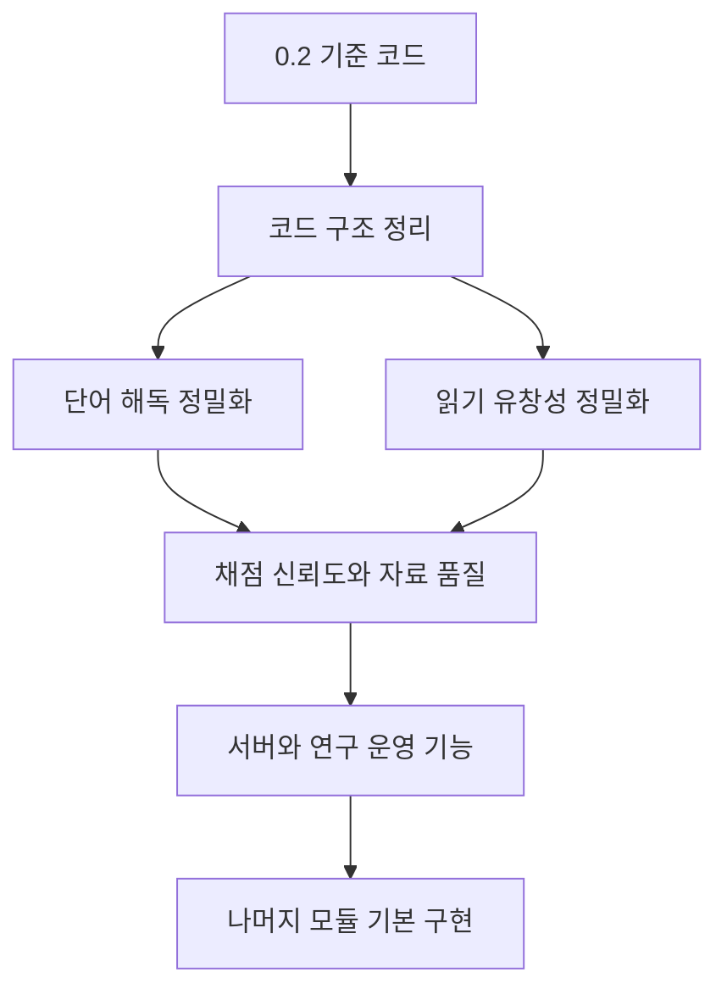

# 구현 계획 — 한국어 읽기평가 연구용 프로토타입

## 1. 목표

이 프로젝트는 아동부터 성인까지 사용할 수 있는 한국어 읽기평가의 디지털 흐름을 구현한다.

개발 우선순위는 다음과 같다.

1. **최우선:** 단어 해독과 읽기 유창성 모듈을 촘촘하게 구현한다.
2. **그다음:** 음운 인식, 철자, 빠른 이름대기, 읽기 이해 등 나머지 경로를 기본 수준으로 구현한다.
3. **현재 제외:** 난독증 진단, 표준점수, 백분위, 임상적 위험군 판정은 제공하지 않는다.

현재 팀에는 채점 전문가와 실제 참가자 파일럿이 없다. 따라서 두 팀원의 독립 채점 결과는 `gold data`가 아니라 **잠정 기준 자료**로만 관리한다.

## 2. 현재 기준점: v0.2.0

| 영역 | 현재 상태 |
|---|---|
| 참여자 설정 | 구현됨: 연구용 코드, 연령 구간, 모듈 선택 |
| 마이크 점검 | 구현됨: 4초 녹음, 음량·클리핑 후보 표시 |
| 짧은 선별 | 임시 구현: 관찰 기록용이며 검증된 분기규칙은 아님 |
| 단어 해독 | 기본 구현: 연습 1개, 후보 문항 16개, 녹음·재녹음 |
| 읽기 유창성 | 기본 구현: 연습 지문 1개, 후보 지문 2개, 녹음·시간 기록 |
| 사람 채점 | 구현됨: 채점자 A/B 독립 기록 |
| 판정 합치기 | 구현됨: `AGREE`, `CONSENSUS`, `EXPERT_PENDING`, `INVALID_AUDIO` |
| 결과 | 구현됨: 진단 없이 연구용 원점수와 보류 상태만 표시 |
| 저장 | 구현됨: 한 브라우저의 `localStorage`와 `IndexedDB` |
| 서버·로그인 | 미구현 |
| 문항 타당화·규준 | 미실시 |

## 3. 전체 개발 순서



## 4. 단계별 구현 계획

### 단계 0 — GitHub 기준점 만들기

목표 버전: `v0.2.0`

- [x] 현재 작동 코드를 저장소 최상위에 배치
- [x] README와 코드 설계도 작성
- [x] 자바스크립트 문법 및 핵심 화면 smoke test 추가
- [ ] GitHub 저장소 생성 후 최초 커밋
- [ ] `v0.2.0` 태그 생성
- [ ] GitHub Pages에서 마이크·녹음·다운로드 수동 확인

완료 기준:

- 새로 저장소를 내려받은 사람이 README만 보고 실행할 수 있다.
- `npm run check`가 통과한다.
- HTTPS로 배포한 페이지에서 녹음과 재생이 작동한다.

### 단계 1 — 개발하기 쉬운 코드 구조로 분리

목표 버전: `v0.3.0`

현재 `app.js` 하나에 대부분의 기능이 들어 있다. 기능을 추가하기 전에 역할별 파일로 나눈다.

```text
src/
├── app.js                    # 화면 이동과 앱 시작
├── data/
│   └── stimuli.js            # 단어·지문과 콘텐츠 버전
├── audio/
│   ├── recorder.js           # 녹음 시작·종료·재녹음
│   └── quality.js            # 음량·클리핑 확인
├── storage/
│   ├── sessions.js           # 세션 정보 저장
│   └── audio-store.js        # 음성 IndexedDB 저장
├── scoring/
│   ├── decoding.js           # 해독 채점 자료 처리
│   ├── fluency.js            # 유창성 채점 자료 처리
│   └── adjudication.js       # A/B 비교와 최종 상태
└── views/                    # 화면별 표시와 이벤트 연결
```

- [ ] 현재 동작을 바꾸지 않고 파일만 역할별로 분리
- [ ] 공통 데이터 형식을 `schemaVersion`으로 관리
- [ ] 이전 v0.2 자료를 읽는 migration test 작성
- [ ] 각 모듈에서 전역 `state` 직접 변경을 줄임

완료 기준:

- 기존 v0.2 기능이 그대로 작동한다.
- 저장, 녹음, 채점 코드를 서로 독립적으로 테스트할 수 있다.

### 단계 2 — 단어 해독 모듈 정밀화

목표 버전: `v0.4.0`

- [ ] 실제단어와 비단어 후보를 별도 데이터로 관리
- [ ] 예상 발음을 하나가 아닌 허용 발음 목록으로 저장 가능하게 변경
- [ ] 정답·오답·채점 불가 외에 오류 위치와 오류 종류 기록
- [ ] 첫 시도와 최종 시도를 구분
- [ ] 자기수정, 반복, 대치, 생략, 삽입, 무응답을 시간과 함께 기록
- [ ] 비단어가 실제 어휘·형태소와 충돌하는지 검토 상태 표시
- [ ] 문항 순서 무작위화 여부와 제시 순서 저장
- [ ] 채점 규칙 예시를 검토 화면에 바로 표시
- [ ] 해독 점수 계산 unit test 작성

완료 기준:

- 한 문항에 대해 원음성, 제시 단어, 전사, 오류, 첫·최종 시도, 채점자와 버전을 다시 확인할 수 있다.
- A와 B가 같은 규칙으로 독립 채점할 수 있다.
- 전문가 미검토 문항은 결과 화면에서 명확히 구분된다.

### 단계 3 — 읽기 유창성 모듈 정밀화

목표 버전: `v0.5.0`

- [ ] 녹음 파형 표시
- [ ] 읽기 시작점, 종료점, 60초 지점을 사람이 수정 가능하게 구현
- [ ] 어절·음절 단위로 오류 위치를 표시
- [ ] 정확하게 읽은 어절·음절 수 계산 규칙 구현
- [ ] 반복, 자기수정, 긴 멈춤, 도움 제공, 외부 방해 기록
- [ ] 전체 시간과 첫 60초 자료를 분리해 보존
- [ ] 지문별 길이, 어절 수, 음절 수를 버전과 함께 저장
- [ ] 유창성 원점수 계산 unit test 작성

완료 기준:

- 같은 녹음을 다시 열어 시작·종료·60초 경계를 재현할 수 있다.
- 사용된 분모와 제외된 오류가 결과에서 설명된다.
- 자동 계산값을 사람이 수정하면 원래 값과 수정값이 모두 남는다.

### 단계 4 — 잠정 기준 자료의 신뢰도 관리

목표 버전: `v0.6.0`

- [ ] 채점 A와 B가 서로의 판정을 보기 전에 독립 저장되도록 제한
- [ ] 문항별 일치율과 Cohen's kappa 등 일치도 통계 산출
- [ ] 합의 전 판정과 합의 후 판정을 모두 보존
- [ ] `EXPERT_PENDING` 자료를 학습·평가 데이터에서 자동 제외
- [ ] 채점 규칙 변경 전후 자료가 섞이지 않도록 경고
- [ ] JSON 내보내기에 앱·문항·채점 규칙 버전 포함 여부 테스트

완료 기준:

- 두 학생의 동의만으로 자료를 전문가 gold data라고 표시하지 않는다.
- 어떤 자료가 일치, 합의, 보류, 무효인지 자동 집계할 수 있다.
- 나중에 전문가가 참여하면 기존 보류 자료에 전문가 판정을 추가할 수 있다.

### 단계 5 — 실제 연구 운영용 서버

목표 버전: `v0.7.0`

- [ ] 관리자·검사자·채점자 역할과 로그인
- [ ] 서버 데이터베이스와 암호화된 음성 저장소
- [ ] 여러 기기에서 같은 세션 접근
- [ ] 자동 저장, 업로드 실패 재시도, 중복 업로드 방지
- [ ] 수정 이력과 접근 기록
- [ ] 동의 상태, 보관 기간, 삭제 처리
- [ ] 참여자 코드와 식별정보 분리

완료 기준:

- 브라우저를 바꿔도 권한이 있는 사용자가 기록을 이어서 검토할 수 있다.
- 음성 업로드 실패가 자료 손실로 이어지지 않는다.
- 누가 언제 무엇을 수정했는지 확인할 수 있다.

### 단계 6 — 나머지 읽기 경로 기본 구현

목표 버전: `v0.8.0`

핵심 두 모듈이 안정된 뒤 동일한 데이터 구조에 아래 모듈을 붙인다.

- [ ] 음운 인식
- [ ] 철자
- [ ] 빠른 이름대기
- [ ] 읽기 이해
- [ ] 연구 목적에 필요한 작업기억 보조 과제

각 모듈의 최소 완료 기준:

- 연습과 본검사가 분리된다.
- 반응, 시간, 도움, 무효 사유가 저장된다.
- 채점 규칙과 콘텐츠 버전이 남는다.
- 결과는 원자료만 표시하며 진단값을 만들지 않는다.

## 5. GitHub 개발 방식

두 명의 팀에는 `main + 작업별 브랜치 + Pull Request` 방식이 적합하다.

### 브랜치

```text
main
feat/decoding-scoring
feat/fluency-waveform
fix/audio-recording
content/review-nonwords
docs/update-rating-manual
```

`main`은 항상 실행 가능한 상태로 유지한다. 하나의 브랜치에는 하나의 기능 또는 문제만 담는다.

### 커밋

```text
feat: 해독 오류 위치 기록 추가
fix: 재녹음 후 이전 음성이 남는 문제 수정
content: 비단어 후보 목록 수정
docs: 유창성 채점 규칙 예시 추가
test: A/B 판정 비교 테스트 추가
refactor: 음성 저장 코드를 별도 모듈로 분리
```

문항 변경, 채점 규칙 변경, 프로그램 변경은 서로 다른 커밋으로 남긴다.

### Pull Request 확인 항목

- [ ] `npm run check` 통과
- [ ] 마이크 권한 거부·허용 상황 확인
- [ ] 녹음, 재녹음, 재생 확인
- [ ] 기존 세션 자료가 열리는지 확인
- [ ] 연습 문항이 점수에서 제외되는지 확인
- [ ] 진단·표준점수 문구가 새로 생기지 않았는지 확인
- [ ] 문항 또는 규칙 변경 시 해당 버전을 올렸는지 확인

## 6. 버전 관리 규칙

| 바뀐 것 | 올려야 하는 버전 |
|---|---|
| 화면·기능·데이터 구조 | 앱 버전, 필요하면 `schemaVersion` |
| 단어·비단어·지문 | `CONTENT_VERSION` |
| 정오·오류·유창성 계산 규칙 | `RATING_VERSION` |
| 연구상 허용·제외 정책 | `POLICY_VERSION` |

버전 예시:

```javascript
const POLICY_VERSION = 'reading-research-policy-0.2';
const CONTENT_VERSION = 'engineering-form-0.2';
const RATING_VERSION = 'dual-rater-rule-0.2';
```

모든 커밋에 `v0.2.1` 같은 번호를 붙이지 않는다. 여러 커밋이 모여 실제로 사용할 수 있는 기준점이 되었을 때만 Git 태그를 만든다.

## 7. 지금 바로 만들 GitHub 이슈

1. `chore: GitHub Pages에서 v0.2 수동 점검`
2. `refactor: app.js를 역할별 모듈로 분리`
3. `feat: 해독 오류의 위치와 시간 기록`
4. `feat: 유창성 녹음 파형과 60초 경계 편집`
5. `test: 채점 A/B 판정 상태 unit test`
6. `content: 비단어 후보의 어휘·형태소 충돌 검토`
7. `docs: 단어 해독과 유창성 채점 매뉴얼 작성`

첫 개발 스프린트에서는 **2번 코드 구조 분리와 5번 판정 테스트**를 먼저 진행한 뒤, 3번 단어 해독 정밀화와 4번 유창성 정밀화를 병렬로 진행한다.

## 8. 프로젝트 완료의 의미

이 프로젝트의 1차 성공은 진단 도구 완성이 아니다. 다음 조건을 만족하는 연구용 프로토타입 완성이다.

- 단어 해독과 읽기 유창성 자료가 손실 없이 수집된다.
- 두 사람이 같은 규칙으로 독립 채점할 수 있다.
- 판정의 일치·합의·보류 과정이 추적된다.
- 결과 숫자가 어떤 원음성, 전사, 오류, 규칙에서 나왔는지 설명할 수 있다.
- 검증되지 않은 문항이나 자료가 진단 결과처럼 표시되지 않는다.
