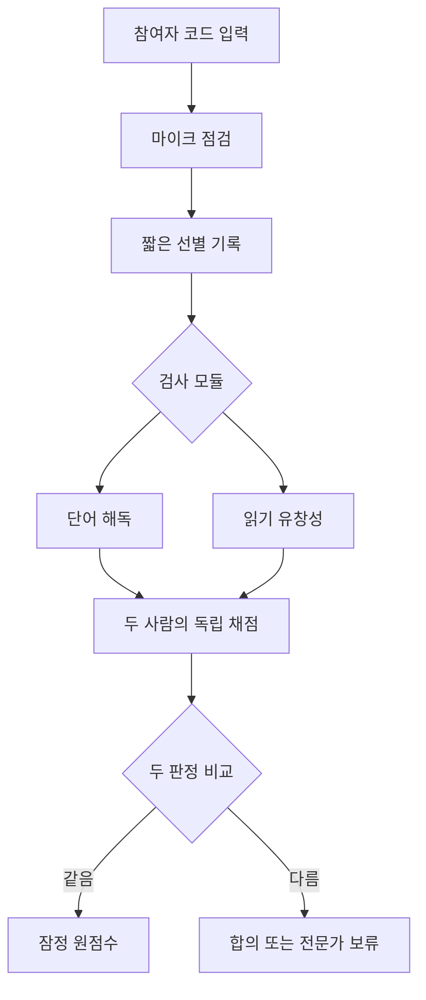
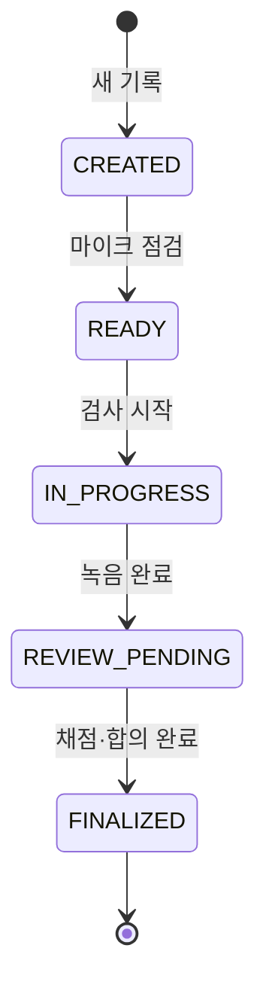
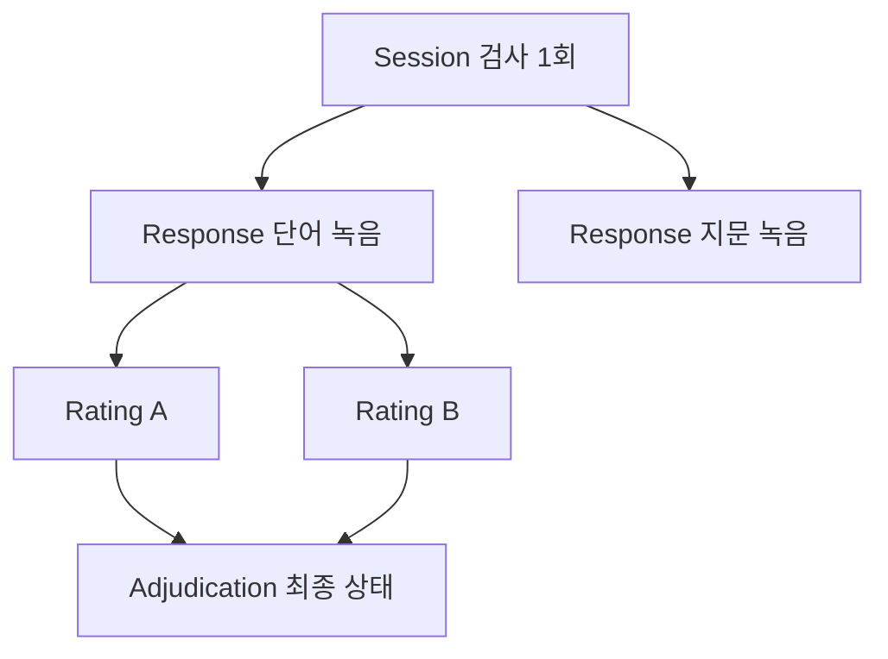
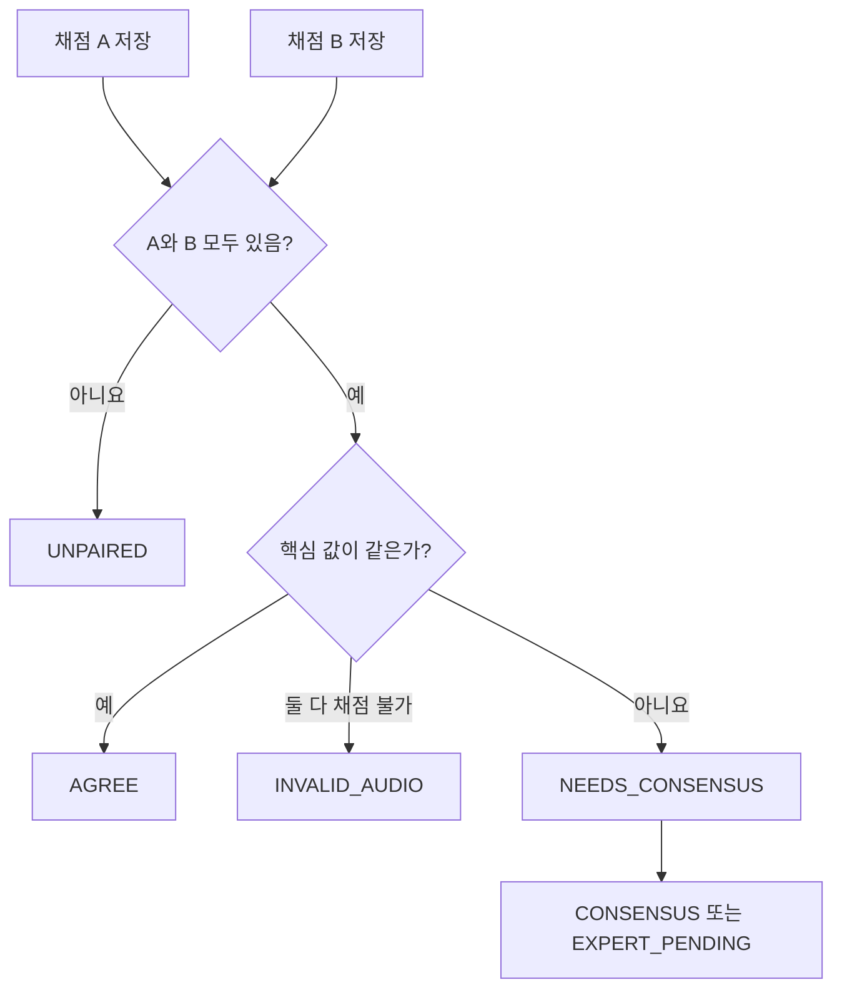

# 코드 설계도 — 쉽게 읽는 설명

## 1. 이 프로그램은 무엇을 하나요?

학생이나 성인이 화면에 나온 단어나 글을 읽으면 프로그램이 목소리를 녹음합니다. 그 뒤 두 명의 채점자가 녹음을 따로 듣고 판정합니다. 프로그램은 두 판정이 같은지 비교하고, 확정할 수 있는 원점수만 보여줍니다.

이 프로그램 자체가 난독증을 진단하지는 않습니다.

## 2. 전체 흐름

쉽게 비유하면 다음과 같습니다.

| 파일·저장소 | 사람으로 비유하면 | 실제 역할 |
|---|---|---|
| `index.html` | 뼈대 | 버튼, 입력칸, 검사 화면을 만듭니다. |
| `styles.css` | 옷과 꾸밈 | 색, 크기, 간격, 휴대폰 화면 배치를 정합니다. |
| `app.js` | 두뇌 | 검사 순서, 녹음, 채점 비교, 결과 계산을 처리합니다. |
| `localStorage` | 작은 수첩 | 참여자 코드, 검사 상태, 채점 글자를 저장합니다. |
| `IndexedDB` | 큰 보관함 | 용량이 큰 음성 파일을 저장합니다. |

## 3. 화면이 움직이는 방법

`index.html` 안에는 여러 화면의 원본이 `<template>`으로 준비되어 있습니다. `app.js`의 `render()` 함수가 필요한 화면 하나를 골라 보여줍니다.

| 화면 이름 | 사용자가 하는 일 | 관련 함수 |
|---|---|---|
| 처음 화면 | 새 검사, 검토, 결과 중 하나를 선택 | `home()` |
| 정보 입력 | 참여자 코드·연령·검사 모듈 선택 | `setup()` |
| 마이크 점검 | 4초 동안 목소리 입력 확인 | `mic()`, `analyzeAudio()` |
| 짧은 선별 | 관찰된 읽기 어려움을 기록 | `screen()` |
| 경로 확인 | 이번에 실행할 검사 확인 | `route()` |
| 검사 | 단어나 지문을 보고 녹음 | `task()` |
| 사람 검토 | A와 B가 따로 전사·오류·점수 입력 | `review()`, `drawDetail()` |
| 결과 | 확정된 원점수와 보류 상태 확인 | `drawResult()` |

## 4. 한 번의 검사 자료는 어떻게 생겼나요?

가장 큰 상자는 `Session`입니다. Session 하나가 참여자 한 명의 검사 한 번을 뜻합니다.

| 자료 | 들어 있는 내용 |
|---|---|
| `Session` | 참여자 코드, 연령 구간, 버전, 검사 상태, 여러 응답 |
| `Response` | 어떤 문항인지, 녹음 키, 시간, 임시 음질, 채점 두 개 |
| `Rating A/B` | 채점자 코드, 전사, 정오, 오류 종류, 메모 |
| `Adjudication` | 일치·합의·전문가 보류·음성 무효 중 최종 상태 |

음성 자체는 Session 안에 넣지 않습니다. Session에는 음성을 찾을 수 있는 `audioKey`만 적고, 실제 음성은 `IndexedDB`에 저장합니다. 큰 음성과 작은 글 정보를 나누면 브라우저가 더 안정적으로 움직입니다.

## 5. 두 채점자의 판정은 어떻게 합치나요?

- `AGREE`: 두 사람이 같은 판정을 냈습니다.
- `CONSENSUS`: 처음에는 달랐지만 다시 듣고 합의했습니다.
- `EXPERT_PENDING`: 두 사람이 합의하지 못해 전문가 확인을 기다립니다.
- `INVALID_AUDIO`: 음질 등의 문제로 채점할 수 없습니다.

`AGREE`와 `CONSENSUS`는 결과에 사용할 수 있지만, 서로 다른 종류의 근거이므로 구분해서 보존합니다. `EXPERT_PENDING`과 `INVALID_AUDIO`는 원점수 계산에서 제외합니다.

## 6. 자동 계산을 왜 정답으로 쓰지 않나요?

현재 코드는 사람이 입력한 전사와 예상 발음을 비교해 문자열 편집거리를 보여줄 수 있습니다. 이것은 글자 몇 개가 바뀌었는지를 알려주는 참고 숫자입니다.

하지만 한국어 읽기에는 연음, 비음화, 유음화, 자기수정, 반복처럼 단순한 글자 비교만으로 판단하기 어려운 일이 많습니다. 그래서 이 숫자는 사람의 확인을 돕기만 하고 최종 점수가 되지 않습니다.

## 7. 현재 설계의 안전장치

- 연습 문항은 점수에서 제외합니다.
- 원음성, 전사, 오류 사건, 채점자, 버전을 함께 남깁니다.
- A와 B의 기록을 덮어쓰지 않고 따로 보존합니다.
- 합의하지 못한 자료는 억지로 정답으로 만들지 않습니다.
- 진단명, 백분위, 표준점수를 표시하지 않습니다.
- 참여자 이름 대신 연구용 코드를 받습니다.

## 8. 앞으로 개발할 순서

### 1순위: 두 핵심 모듈을 더 촘촘하게

1. 전문가 자문으로 단어·비단어의 정답 발음과 채점 규칙을 확정합니다.
2. 유창성 지문 난이도와 길이를 연령 구간별로 만듭니다.
3. 음성 파형에서 시작·끝·60초 지점을 고칠 수 있게 합니다.
4. 오류 위치를 음절·어절 단위로 표시하게 합니다.
5. 채점자 일치도와 합의 전·후 기록을 자동 보고서로 만듭니다.

### 2순위: 실제 연구 운영에 필요한 서버

1. 로그인과 역할 권한을 만듭니다.
2. 음성과 채점 자료를 암호화해 서버에 저장합니다.
3. 여러 기기에서 같은 기록을 검토할 수 있게 합니다.
4. 수정 이력과 자료 내보내기·삭제 이력을 남깁니다.

### 3순위: 다른 읽기 경로를 얕게 추가

- 음운 인식
- 철자
- 빠른 이름대기
- 읽기 이해
- 작업기억 등 연구 목적에 필요한 보조 모듈

이 모듈들은 핵심 두 모듈의 품질이 안정된 다음, 같은 `Session → Response → Rating → Adjudication` 구조에 붙이면 됩니다.

## 9. 가장 중요한 한계

지금 버전은 “검사 진행과 자료 구조가 실제로 돌아가는지” 확인하는 연구용 프로토타입입니다. 검사도구의 타당도와 신뢰도가 입증된 상태는 아닙니다. 실제 참여자에게 쓰기 전에는 문항 검토, 전문가 자문, 연구윤리 심의, 동의 절차, 파일럿 또는 그에 준하는 사용성·채점 검증이 필요합니다.
