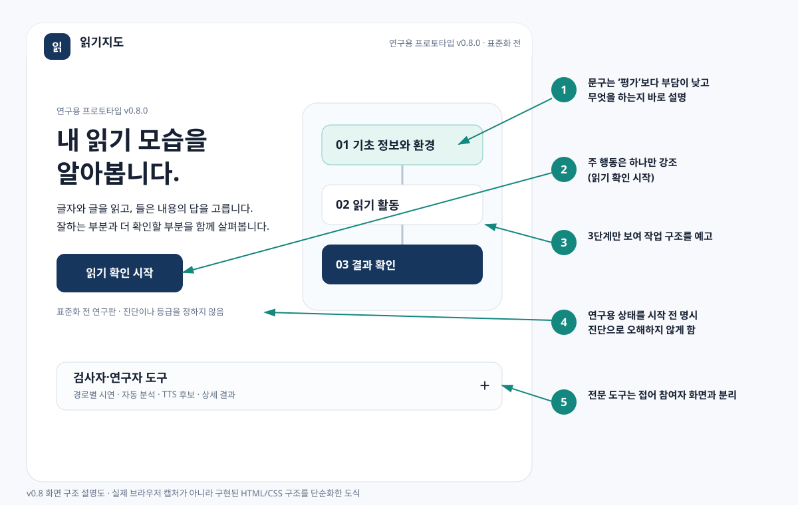
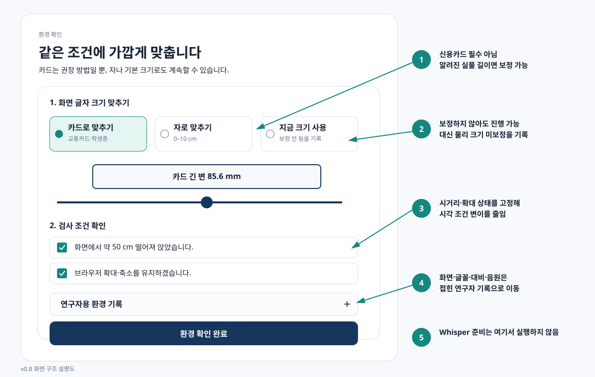
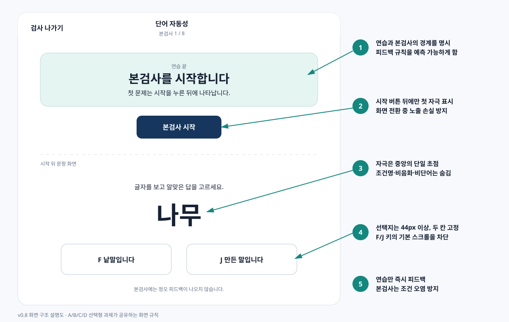
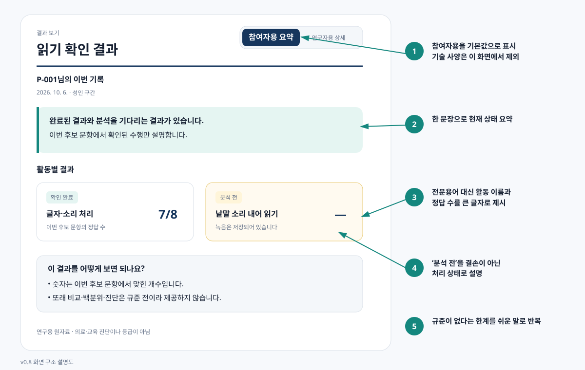

# v0.8 설계 근거서 — 한국어 읽기능력평가 연구용 프로토타입

작성일: 2026-10-06  
대상 버전: `연구용 프로토타입 v0.8.0` / `assessment-spec-0.3`  
목적: 2026-10-05 교수 피드백에 따라 참여자 UI, 검사 제시, 음성, 성능, 채점, 결과 전달의 설계 결정을 한 문서에서 설명한다.

## 1. 먼저 구분할 세 수준

이 문서에서 “근거가 있다”는 말을 세 수준으로 나눈다.

| 표시 | 뜻 | 이 버전에서의 처리 |
|---|---|---|
| 표준·반복 연구 | 접근성 표준, 다수 연구 또는 공인 평가 원칙이 직접 지지 | 구현 기준으로 고정 |
| 문헌 기반 후보 | 방향은 지지되지만 한국어·전 연령·이 문항에서 최적값은 아님 | 코드로 관리하고 파일럿에서 검증 |
| 연구 가설 | 효과를 검증해야 하는 실험 조건 | 참여자 기본 점수와 분리 |

따라서 `Noto Sans KR`, 18 mm 낱말, 5.3 mm 지문, 220–280 SPM 같은 값은 “누구에게나 최적이라고 이미 검증된 값”이 아니다. 표준과 문헌을 바탕으로 만든 **파일럿 후보값**이며 한국어 아동·청소년·성인, 난독증 및 지적장애 참여자에게 실제로 읽기 정확도·속도·이해·선호를 측정해야 확정할 수 있다.

## 2. 화면 구조 설명도

아래 그림은 실제 구현된 HTML/CSS 구조를 단순화한 설명도다. 자동 브라우저 캡처 권한이 차단되어 스크린샷을 가장한 이미지를 만들지 않고, 위치와 설계 의도를 확인할 수 있는 번호 설명도로 작성했다.

## 3. 전 화면 공통 원칙

### 3.1 문구

- 짧은 문장, 익숙한 말, 한 문장 한 뜻을 사용한다.
- 참여자에게 필요한 행동을 먼저 말한다. 내부 용어인 `비음화`, `비단어`, `L0/L1/L2`, 모델명, 해상도는 기본 화면에서 숨긴다.
- 버튼은 결과가 예측되는 동사구로 쓴다. 첫 화면의 `검사 시작`은 `읽기 확인 시작`으로 바꿨다. “검사”의 평가·실패 부담을 줄이면서 실제 행동을 더 구체적으로 알리기 위해서다.
- W3C 인지 접근성 지침은 쉬운 단어, 짧은 문장, 짧은 텍스트 덩어리, 모호하지 않은 표현, 지시 분리, 여백을 권한다. 이 기준을 문구 편집의 직접 근거로 사용했다. [W3C Clear and Understandable Content](https://www.w3.org/WAI/WCAG2/supplemental/objectives/o3-clear-content/)

### 3.2 글꼴

- 기본 글꼴: `Noto Sans KR`; 실패 시 `Malgun Gothic`, 일반 sans-serif.
- 이유: 한글 자형이 익숙하고 여러 굵기를 제공하며 웹에서 일관되게 불러올 수 있다. 장식적·낯선 자형을 피한다.
- 난독 전용 글꼴을 쓰지 않은 이유: 2026년 메타분석(15개 연구, 91개 효과크기, N=688)은 전용 글꼴이 전통 글꼴보다 읽기 속도·정확도를 일관되게 높이지 않았고 전체 효과가 거의 0이었다(`g=-0.04`). [Azzarello et al., 2026](https://pubmed.ncbi.nlm.nih.gov/42536336/)
- 결론: “난독 친화 글꼴” 이름을 근거로 선택하지 않고, 익숙한 sans-serif와 충분한 크기·행간·폭·대비를 함께 관리한다.

### 3.3 크기, 행간, 줄 길이

| 용도 | 구현값 | 이유와 상태 |
|---|---:|---|
| 일반 본문 | 기본 16 CSS px 이상 | 브라우저 확대를 방해하지 않는 기준. 상대단위 사용 |
| 낱말 자극 | `clamp(4rem, 10vw, 8rem)`, 보정 시 목표 18 mm | 주변 정보 없이 한 낱말에 주의를 모으는 후보값. 한국어 사용자 파일럿 전 |
| 지문 | `1.3–1.75rem`, 보정 시 5.3 mm, 행간 1.7, 최대 34자 폭 | 긴 줄과 조밀한 행을 피하고 줄 추적 부담을 줄임 |
| 질문·보기 | `1.05–1.25rem`, 보정 시 4.8 mm, 행간 1.65, 최대 42자 폭 | 보기 간 구별과 터치/키보드 사용을 함께 고려 |
| 조작 영역 | 최소 44 CSS px | WCAG 2.2의 24×24 최소보다 여유 있게 정한 프로젝트 기준. 운동·인지 부담 감소 |

WCAG는 텍스트 확대, 리플로, 텍스트 간격 조정이 내용 손실 없이 가능해야 함을 요구한다. 고정 px 하나가 아니라 `rem`, `vw`, `clamp`, 물리 보정값을 함께 쓰는 이유다. [WCAG Resize Text](https://www.w3.org/WAI/WCAG22/Understanding/resize-text.html), [Reflow](https://www.w3.org/WAI/WCAG22/Understanding/reflow.html), [Text Spacing](https://www.w3.org/WAI/WCAG22/Understanding/text-spacing.html)

### 3.4 색

- 기본 글자 `#172133` / 배경 `#f7f9fc`: 계산 대비 `15.3:1`.
- 주요 버튼 `#16365d` / 흰 글자: `12.21:1`.
- 보조 강조 `#0f766e` / 흰색: `5.47:1`. v0.7의 `#14877e`는 흰 배경에서 `4.38:1`이라 작은 글자 AA 4.5:1에 약간 못 미쳐 v0.8에서 더 어둡게 바꿨다.
- 색만으로 상태를 전달하지 않는다. `확인 완료`, `분석 전`, `연습 끝` 같은 글을 함께 쓴다.
- WCAG 2.2는 일반 텍스트 최소 4.5:1을 요구하며, 저시력·노화에 따른 대비 민감도 저하를 이유로 설명한다. [WCAG Contrast Minimum](https://www.w3.org/WAI/WCAG22/Understanding/contrast-minimum.html)

### 3.5 배치

- 한 화면의 주 행동은 하나의 진한 버튼으로 표시한다.
- 안내 → 자극 → 응답의 시각 순서를 위에서 아래로 고정한다.
- 자극은 중앙의 단일 초점에 두고, 본문은 왼쪽 정렬한다. 중앙 정렬 긴 문장은 다음 줄 시작점을 찾기 어렵기 때문이다.
- 반응 선택지는 같은 열·간격을 사용하고 44 px 이상으로 만든다.
- 전문 정보는 삭제하지 않고 접힌 연구자 영역 또는 연구자 결과지로 옮긴다. 측정 재현성은 유지하면서 참여자의 불필요한 읽기 부담을 줄인다.

## 4. 화면별 결정

| 화면 | v0.8 결정 | 설계 이유 |
|---|---|---|
| 첫 화면 | `내 읽기 모습을 알아봅니다` + `읽기 확인 시작` | 기능을 쉬운 말로 즉시 설명하고 실패·진단 뉘앙스를 줄임 |
| 첫 화면 경로 | 정보/환경 → 읽기 활동 → 결과의 3단계 | 전체 A–D 전문 구조 대신 참여자가 지금 예측해야 하는 수준만 표시 |
| 연구자 도구 | 접힌 영역 | 경로 시연, ASR, TTS는 참여자 과업이 아님 |
| 정보 입력 | 참여자 코드·연령·분량만 기본 표시 | 순서 무작위·도움조건은 연구자 설정에 이동 |
| 환경 확인 | 카드/10 cm 자/기본값 세 방법 | 신용카드는 필수가 아님. 알려진 실제 길이가 있으면 px/mm 계산 가능 |
| 마이크 확인 | ASR 상태 제거, 20 fps 수준 계기판 | 장치 점검과 모델 다운로드를 분리하고 애니메이션 부담을 낮춤 |
| 녹음 A/B | 문항 ID·비음화·비단어·조건명 숨김 | 정답 전략이나 불안에 영향을 줄 수 있는 연구자 메타데이터 제거 |
| 녹음 직후 | 저장·다시 듣기·다시 녹음만 표시 | 발화 시작 시각·길이·긴 멈춤은 연구자용 품질 후보라 참여자의 다음 행동에 필요한 정보가 아님 |
| 연습 | 매 문항 정오 피드백 | 조작법과 과제 규칙 학습 |
| 본검사 | 정오 피드백 없음 | 앞 문항 피드백이 뒤 문항 학습·전략을 바꾸는 측정 오염 방지 |
| 연습→본검사 | 별도 준비 화면과 시작 버튼 | 피드백 정책 전환을 명확히 하고 첫 시간제한 자극을 놓치지 않게 함 |
| B 단어 재인 | 첫 자극은 시작 버튼 뒤 표시 | 화면 전환과 동시에 350 ms 자극이 나와 놓치는 오류 제거 |
| F/J 입력 | 기본 키 동작 차단, 같은 화면에서는 스크롤 위치 보존 | 키 입력 때문에 페이지가 움직여 다음 자극 위치가 바뀌는 문제 방지 |
| 녹음 다시 듣기 | 기본 켜짐 1.6× 재생 전용 gain | 저장 원음과 채점 입력은 바꾸지 않고 자기 확인 음량만 높임. 클리핑 시 끌 수 있음 |
| C/D | 같은 글자·폭·보기 규칙 공유 | 모듈에 따라 표현 형식이 달라져 생기는 구성개념 외 변량을 줄임 |
| D 형광펜 | 기본 검사에서는 사용 안 함 | L1 도움 조건에서만 쓰는 연구 가설. 연구자 설정으로 명시적으로 켠 경우에만 실시, 기본 점수와 분리 |
| 결과 | 참여자용 요약이 기본, 연구자 상세 별도 | 일반인에게 활동명·정답 수·분석 상태를 먼저 제공하고 기술용어를 분리 |

### 4.1 구현 화면 전체 목록

| 템플릿/화면 | 참여자에게 보이는 핵심 | 배치 근거 |
|---|---|---|
| `home` | 목적, 한 개의 시작 버튼, 3단계 | 첫 선택 부담 최소화; 연구자 도구 접기 |
| `setup` | 코드, 연령, 분량 | 개인정보 최소화; 연구 조건은 별도 details |
| `preflight` | 보정 방식, 거리·배율, 감각 보조 | 실제 수행 전에 한 번만 확인; 기술값 접기 |
| `mic` | 한 문장, 입력 막대, 확인 버튼 | 권한 요청과 성공/재시도를 한 화면에 고정 |
| `screen` | 짧은 공통 낱말·문장 읽기 | 전체검사에서만 경로 제안용; 모듈 검증에서는 건너뜀 |
| `route` | 추천된 A–D와 연구자 조정 | 추천과 최종 선택을 분리·기록 |
| `task` | A/B 소리내기 자극, 녹음, 다시 듣기 | 자극을 단일 초점에 두고 메타데이터 숨김 |
| `choice` | A/B/C/D 안내·연습·본문항 | 모든 선택형에서 같은 질문/보기 구조 사용 |
| `scaffold` | D 도움 방식 비교 | 연구자가 켠 경우만; 기본 점수와 시각적으로 분리 |
| `complete` | 저장 완료, 결과, 연구자 분석 | 분석 대기로 참여자를 붙잡지 않음 |
| `report` | 참여자 요약 / 연구자 상세 | 일반인 해석과 기술 분석의 독자 분리 |
| `review`·`result` | 원음성, 사람 채점, ASR 검증 | 연구자 전용 근거 추적 화면 |
| `tts-lab` | 음성·속도·3개 청취평가 | 기기 음성을 점수용으로 쓰기 전 후보 검토 |
| `preview` | 미구현/예시 경로 시연 | 실제 채점과 혼동하지 않도록 `UI 미리보기` 표시 |

선별(`screen`)은 아직 음성 분석이 필요한 전체 흐름의 연구 기능이다. 교수 피드백처럼 현재 우선순위가 모듈별 검증이면 첫 화면의 A/B/C/D 카드로 들어가 선별을 건너뛰는 것이 맞다.

## 5. 화면 크기 보정

보정이 필요한 이유는 CSS px가 물리적 mm와 같지 않기 때문이다. 같은 `64px`도 모니터 크기, 해상도, OS 배율에 따라 눈에 보이는 크기가 달라질 수 있다. 읽기평가에서 글자 크기가 달라지면 읽기 수행 차이에 화면 조건이 섞일 수 있다.

- 카드 방식: ISO/IEC 7810 ID-1의 긴 변 85.60 mm를 기준으로 쓴다. 신용카드 정보는 전혀 읽지 않고 외곽 길이만 비교한다. [ISO/IEC 7810](https://www.iso.org/obp/ui/#iso:std:iso-iec:7810:ed-4:v1:en)
- 자 방식: 100 mm를 기준으로 같은 계산을 한다.
- 기본 방식: 보정 없이 진행할 수 있지만 `UNCALIBRATED_BROWSER_DEFAULT`로 기록한다.
- 계산: `cssPxPerMm = 화면 막대 CSS px / 기준물 실제 mm`.
- 한계: 사용자가 정확히 맞추지 않거나 브라우저 확대를 뒤에 바꾸면 오차가 생긴다. 그래서 50 cm 시거리와 배율 유지 확인을 함께 저장한다.

## 6. TTS 결정

### 6.1 무엇을 선택했나

1. 사람이 검수한 고정 음원이 있으면 항상 우선한다.
2. 고정 음원이 없는 현재 연구판에서는 기기에 설치된 무료 한국어 Web Speech 음성 중 `Microsoft SunHi Online (Natural)` → SunHi → InJoon → 이름에 Natural/Neural/Premium/Enhanced가 있는 음성 순으로 고른다.
3. Microsoft 공식 언어 지원표에 `ko-KR-SunHiNeural`, `ko-KR-InJoonNeural`이 한국어 신경망 음성으로 명시되어 있다. [Microsoft Speech language support](https://learn.microsoft.com/azure/ai-services/speech-service/language-support)
4. Azure Speech F0에는 표준 Neural TTS 월 50만 문자 무료 구간이 있지만, 현재 앱은 API 키·서버를 사용하지 않는다. 브라우저에 해당 음성이 있을 때만 무료 기기 음성으로 쓴다. [Azure Speech pricing](https://azure.microsoft.com/pricing/details/cognitive-services/speech-services/)

`SunHi`가 “한국어 읽기평가에서 검증된 최종 최우수 음성”이라는 직접 비교 연구는 찾지 못했다. 따라서 v0.8의 1순위는 **공식 지원되고 자연음 계열인 파일럿 후보**이지 최종 표준 음성이 아니다.

### 6.2 왜 0.9×인가

0.9×는 더 이상 합격 기준이 아니라 비교 시작값이다. 한국어 명료 발화 연구에서 평균 말속도는 남성 263.4 SPM, 여성 227.9 SPM이었고 일상 발화보다 약 35–45% 느렸다. 이를 바탕으로 220–280 SPM을 성인 명료 발화의 넓은 파일럿 범위로 두었다. [Yoo et al., 2019](https://pmc.ncbi.nlm.nih.gov/articles/PMC6773961/)

연구자 도구는 실제 재생시간으로 SPM을 계산한다. 다음을 모두 만족해야 `PASS` 후보가 된다.

- 실측 220–280 SPM
- 자연스러움 4/5 이상
- 명료도 4/5 이상
- 속도 적절성 4/5 이상

이 범위는 아동·지적장애인을 포함한 전 연령 규준이 아니다. 대상 집단별 청취 이해도와 최소대립 지각을 파일럿해 조정해야 한다.

### 6.3 `물/뿔` 같은 최소대립 낱말

짧은 단독 낱말은 합성음의 억양·종성·긴장음 오류가 문항 정답에 직접 영향을 준다. v0.8은 좋은 자연음 후보를 우선하고 세션 음성과 SPM을 고정·기록하지만, 이것만으로 문항 타당성이 완성되지 않는다. A 글자-소리 대응의 점수용 음원은 다음 순서로 확정해야 한다.

1. 표준어 화자 녹음 또는 고정 신경망 음성 생성
2. 음성학/국어교육 전문가의 발음 검수
3. 최소대립 낱말별 성인·아동 식별률 파일럿
4. 통과한 동일 파일을 모든 기기에서 재생

현재 `tts-assets.js` manifest는 이 검증 음원을 넣을 자리를 제공하지만 준비된 고정 음원은 0개다. 이 항목은 코드 결함이 아니라 **외부 음원 타당화가 필요한 미완료 연구 항목**으로 명시한다.

## 7. 연습 피드백

- 연습: 맞으면 `맞았어요!`, 틀리면 정답을 알려 준다.
- 본검사: 정오 피드백 없음.
- v0.7의 문제는 규칙 자체보다 연습과 본검사의 경계가 약해 “첫 문제만 피드백”처럼 보인 점이다. v0.8은 `연습` 배너와 `연습 끝 / 본검사 시작` 화면을 추가했다.
- 표준화된 검사에서 본검사 중 정답을 알려 주면 학습과 전략 변화가 뒤 문항 점수에 섞인다. 연습은 응답 방식 이해, 본검사는 동일 조건 측정이라는 역할을 분리한다. [Standards for Educational and Psychological Testing](https://www.testingstandards.net/open-access-files.html)

## 8. ASR·렉·자동채점의 SE 설계

### 8.1 v0.7 원인

`server.mjs`는 HTML/JS/음원 파일만 보내는 정적 서버다. Whisper 추론 서버는 없다. 브라우저가 jsDelivr에서 Transformers.js를 받고 Hugging Face에서 모델 가중치를 받아 캐시한 뒤, 사용자 기기의 WebGPU 또는 WASM으로 추론했다.

환경 확인에서 자동 `preloadAsr()` → 수백 MB 다운로드 → 모델 초기화 → WebGPU 셰이더 컴파일/예열이 실행됐다. 이 작업이 네트워크, 메모리, GPU/CPU와 메인 화면 자원을 함께 사용해 스크롤·마이크 화면 렉을 만들었다. 검사 종료 뒤 모든 녹음을 순차 분석하면서 결과 버튼도 몇 분간 막았다.

### 8.2 v0.8 변경

- 참여자 흐름에서는 Whisper를 자동 import·다운로드·예열·추론하지 않는다.
- 녹음은 IndexedDB에 먼저 저장하고 `DEFERRED_UNTIL_RESEARCHER_REQUEST`로 표시한다.
- 검사 종료는 즉시 가능하며 참여자용 결과에서 녹음 항목을 `분석 전`으로 설명한다.
- 연구자가 `자동 채점 검증 → AI 분석`을 눌렀을 때만 분석한다.
- 기본 모델은 `Whisper small multilingual` 양자화 후보로 낮췄다. WebGPU small → WASM small → base 순으로 실패 대응한다.
- large-v3-turbo는 연구자가 `readingAsrProfile=accuracy`를 명시한 검증 조건에서만 우선한다.
- 낱말은 타임스탬프 계산을 생략하고 생성 토큰을 24개로 제한해 짧은 음성의 반복 환각과 대기를 줄인다.
- 마이크 계기판 FFT를 256→64로 줄이고 약 20 fps로 제한했다.
- 다음 두 선택형 문항 DOM을 유휴시간에 준비하고, 시간 자극은 두 프레임 뒤부터 `performance.now()`로 잰다.

Whisper/Transformers.js 선택 자체는 다국어·브라우저 내 처리·WebGPU 지원 때문에 적합한 공학 후보다. 한국어 아동·비단어 정확도는 보장되지 않으므로 CER/WER, 문항 정오 일치, Cohen's κ, real-time factor를 사람 전사와 비교해야 한다. [Whisper large-v3-turbo model card](https://huggingface.co/openai/whisper-large-v3-turbo), [Transformers.js WebGPU](https://huggingface.co/docs/transformers.js/guides/webgpu)

## 9. 결과지

### 참여자용

- 쉬운 활동 이름, 정답/문항 수, 분석 완료/대기 상태를 큰 카드로 표시한다.
- “이번 후보 문항 안에서 가장 높은 정답 비율”만 기술한다.
- 규준이 없으므로 또래보다 잘함/낮음, 백분위, 표준점수, 난독 위험을 제공하지 않는다.
- 분석 전은 실패가 아니라 처리 상태라고 설명한다.

### 연구자용

- 문항 조건, 오류 위치, 반응시간, 신뢰구간, 사람-자동 일치도, 원음성 추적을 유지한다.
- 기술 사양은 결과 해석과 섞지 않고 별도 [v0.8 기술 사양서](V0_8_TECHNICAL_SPEC_KO.md)로 옮겼다.

## 10. 검사 방식·문항 형식의 타당성 상태

| 영역 | 디지털 구현 근거 | 현재 판단 |
|---|---|---|
| A 음운인식 | 음절/음소 탈락·대치 선택형 | 널리 쓰이는 과제 형식. 한국어 문항 난이도·보기 기능은 미검증 |
| A 글자-소리 | 최소대립 낱말 듣고 고르기 | 목표 대응을 분리 가능. 고정 음원 지각률 검증 필수 |
| A 해독 | 실제/비단어 × 표기-발음 일치/변동, 소리내기 | 어휘 도움과 음운규칙 부담을 분리. 비단어·허용발음 전문가 검토 필요 |
| B 단어 재인 | 짧은 노출 뒤 실제단어/만든 말 판단 | 자동성·민감도 측정 후보. 350 ms와 한국어 문항의 연령 적합성 파일럿 필요 |
| B 묵독 | 제한시간 문장 참/거짓 | 속도+이해 효율 후보. 한국어 규준과 동형성 없음 |
| B 낭독 | 원음성, 정확도, 분당 정확 어절/음절 | 디지털 계측에 적합. ASR만으로 최종 판정 불가 |
| C | 어휘·문장·듣기·형태소 선택형 | 해독 부담과 언어 이해를 일부 분리. 읽기 보기 자체가 부담이 될 수 있음 |
| D | 사실·추론·평가·복수 글 | 읽기 이해 과정 분리 후보. 지문·문항 난이도와 연령 적합성 미검증 |
| D 도움 실험 | 도움 없음/핵심 표시/분절+듣기 | 연구 가설. 동형성 검증 전 기본 점수에 합치지 않음 |

즉 “디지털적으로 가장 좋은 방법이 확정되었다”가 아니라, 구성요소별 측정과 로그 추적이 가능한 **검증 가능한 설계**가 된 상태다.

## 11. 아동·청소년·성인 구분

연령 구간은 현재 연구 분석 변수로 저장하지만 글자 크기, 문항, 합격선, 최종 해석을 자동 변경하지 않는다. 이유는 다음과 같다.

- 연령별로 화면과 문항을 바꾸면 수행 차이가 능력 때문인지 UI/문항 차이 때문인지 분리하기 어렵다.
- 현재 한국어 규준과 연령별 문항 동등성이 없다.
- v0.7의 임시 속도 기준(아동 120/청소년 200/성인 250 SPM)은 근거가 충분하지 않아 v0.8에서 자동 분기에 사용하지 않게 했다. 속도는 기술 통계로만 저장한다.

연령 구분이 실제 점수 해석에 의미를 가지려면 연령층별 대표 표본, 측정동일성/DIF, 신뢰도, 규준 또는 준거점수가 필요하다. 그 전에는 동일 UI·동일 사양으로 실시하고 연령을 공변량으로 분석하는 것이 더 정직하다.

## 12. 아직 사람 검증이 필요한 항목

다음은 v0.8 코드로 “완료”라고 주장하지 않는다.

1. Noto Sans KR과 크기·행간 후보의 대상 집단별 읽기 성능/선호 비교
2. SunHi/InJoon 및 고정 음원에 대한 아동·청소년·성인, 난독증·지적장애 집단의 명료도와 최소대립 식별률
3. A–D 문항의 내용타당도, 난이도, 변별도, 신뢰도, 동형성, DIF
4. Whisper small/large의 한국어 아동·비단어 CER/WER와 사람 채점 일치도
5. 화면 보정 오차와 50 cm 시거리 준수
6. 참여자용 결과 문구의 이해도 인터뷰

이 구분이 교수 질문에 대한 핵심 답이다. 구현 근거와 실증 완료를 섞지 않고, 파일럿 전 후보값은 후보라고 표시한다.
